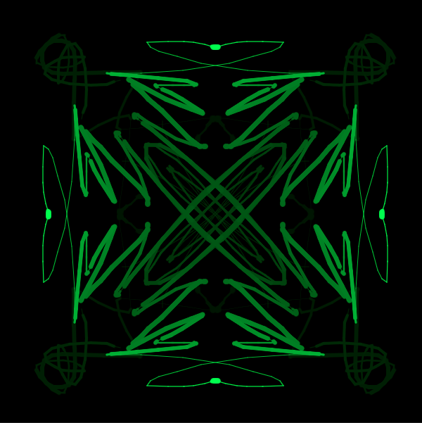
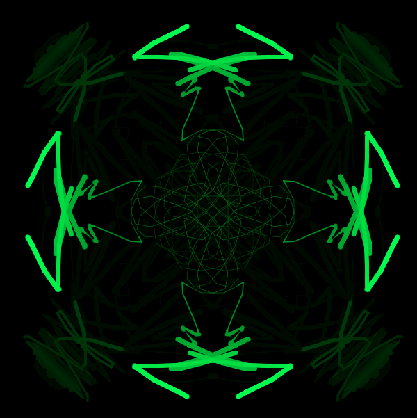
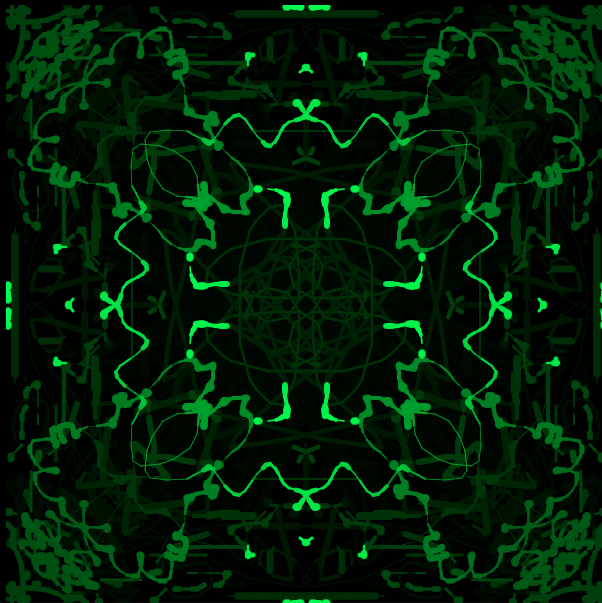
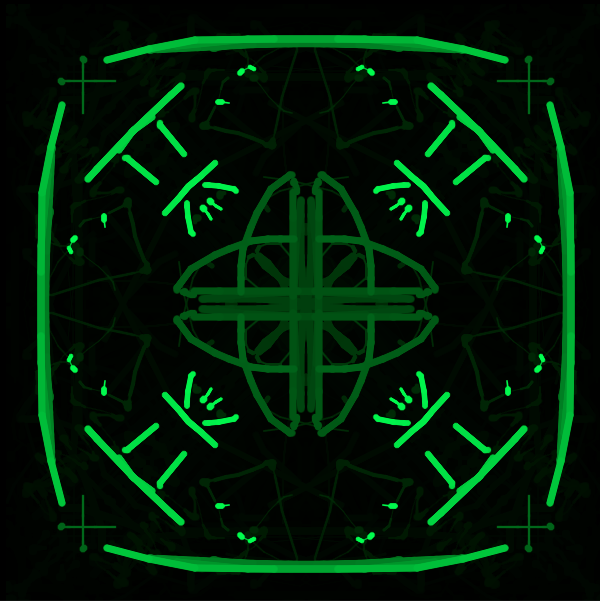

Rave Painter
=========================

A small application developed in Processing while trying to get familiar with the environment. Inspired by the "Sonic Painter" tutorial application presented in week 1 of the the "Creative Programming for Digital Media & Mobile Apps" MOOC on Coursera (https://class.coursera.org/digitalmedia-003).

Live demo [here](http://dfilaretti.github.io/software/RavePainter/web-export/)

Screencast [here](https://www.youtube.com/watch?v=6PG5SSjGSA8)

